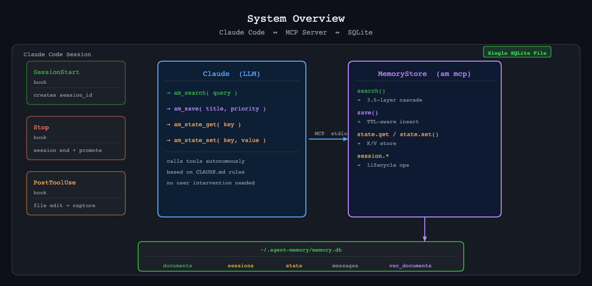
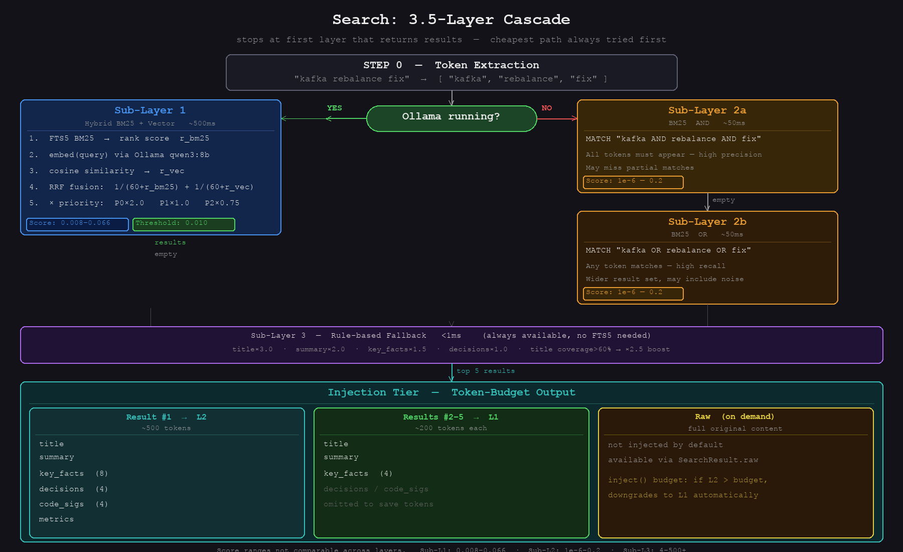
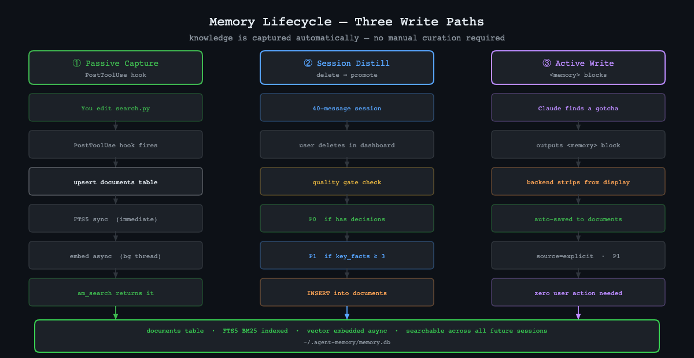
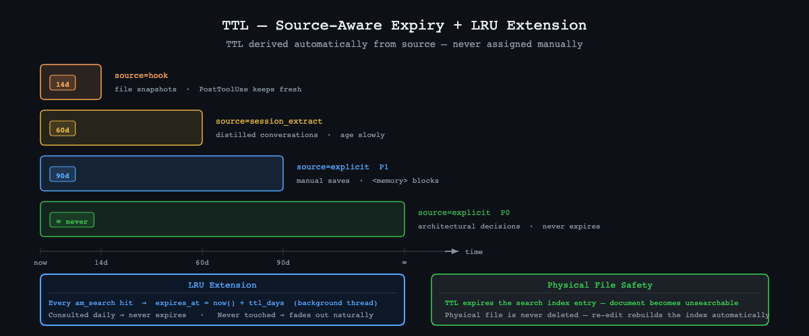

# agentmem

Persistent memory for [Claude Code](https://claude.ai/code) — a self-evolving knowledge layer that survives across sessions, grows from every conversation, and surfaces relevant context automatically.

```
pip install agentmem
am init
# Restart Claude Code → done
```

No external database. No cloud service. A single SQLite file at `~/.agentmem/memory.db`.

---

## What problem does this solve?

Every Claude Code session starts from zero. Context window fills up. You re-explain the same architecture, re-debug the same gotchas, re-type the same config values — session after session.

`agentmem` gives Claude a memory that persists across sessions. Knowledge is captured automatically from your conversations and file edits. A debugging insight from six months ago surfaces when it's relevant today.

---

## Quick Start

**Requirements:** Python 3.10+, Claude Code

```bash
pip install agentmem
am init
```

`am init` does everything in one shot:

```
✓ Created ~/.agentmem/memory.db
✓ Registered MCP server in ~/.claude/mcp.json
✓ Installed hook: ~/.claude/hooks/SessionStart/agentmem.sh
✓ Installed hook: ~/.claude/hooks/Stop/agentmem.sh
✓ Appended memory instructions to ~/.claude/CLAUDE.md
```

Restart Claude Code. Done. Claude can now search and save memory across sessions.

---

## How it works

### The big picture



### Session lifecycle

```
Claude Code opens
      │
      ▼
SessionStart hook
  → am session start --project myproject
  → writes session_id to state table
      │
      ▼
Claude works (multiple turns)
  → calls am_search before answering
  → calls am_save when it learns something
      │
      ▼
Claude Code closes (Stop hook)
  → am session end
  → quality-gate promote:
      decisions non-empty  → P0 (never expires)
      key_facts ≥ 3        → P1 (90 days)
      else                 → P2 (30 days)
  → session promoted to documents table
  → raw session + messages deleted
```

---

## Architecture: memory.db

One SQLite file. Four semantic layers.

```
~/.agentmem/memory.db
│
│  ── SEARCH LAYER (virtual) ──────────────────────────────────────
│
├── documents_fts          FTS5 virtual table
│                          trigram tokenizer (Chinese + English)
│                          indexes: title, summary, key_facts, decisions
│                          auto-synced via INSERT/UPDATE/DELETE triggers
│                          BM25 ranking
│
├── vec_documents           sqlite-vec virtual table (optional)
│                          float32[4096] HNSW index
│                          cosine similarity
│                          joined to documents via document_id FK
│
│  ── KNOWLEDGE LAYER ─────────────────────────────────────────────
│
├── documents              long-term knowledge store
│   ├── doc_id             INTEGER PK
│   ├── title              TEXT  — primary search signal, BM25 weight ×3
│   ├── summary            TEXT  — 2-3 sentence distillation
│   ├── key_facts          TEXT  — JSON array of extracted facts
│   ├── decisions          TEXT  — JSON array of architectural decisions
│   ├── code_sigs          TEXT  — function/class names mentioned
│   ├── embedding          BLOB  — float32[4096], populated async
│   ├── priority           P0 | P1 | P2
│   ├── source             explicit | session_extract | hook | file
│   ├── file_path          TEXT UNIQUE  — upsert key for file-sourced docs
│   ├── expires_at         REAL  — NULL = never expires (P0)
│   └── last_accessed_at   REAL  — updated on every search hit (LRU)
│
│  ── CONVERSATION LAYER ──────────────────────────────────────────
│
├── sessions               session lifecycle records
│   ├── session_id         TEXT PK
│   ├── project, topic     metadata
│   ├── source             "cli:myproject"
│   ├── summary            extracted at session end
│   ├── key_facts          JSON array
│   └── decisions          JSON array
│
├── messages               raw message storage (30-day TTL, auto-pruned)
│
│  ── WORKING MEMORY ──────────────────────────────────────────────
│
└── state                  K/V working memory
    ├── current_session_id
    ├── active_work        JSON: { ticket, topic, ... }
    └── scratchpad         freeform per-session notes
```

---

## Architecture: search

Every `am_search` call flows through a 3.5-layer cascade. It stops at the first layer that returns results. The cheapest path is always tried first.



> **Score ranges are not comparable across layers.**
> Sub-L1: 0.008–0.066 · Sub-L2: 1e-6–0.2 · Sub-L3: 4–500+
> Detect origin by magnitude.

---

## Architecture: memory lifecycle

Memory is not static. Three automated paths write to it continuously.



### TTL + LRU

TTL is derived automatically from `source`. Accessed documents have their TTL reset on every search hit — frequently used knowledge never expires.



> **TTL only affects the search index.** Physical files in your knowledge base are never deleted. An expired document is unsearchable, but the file remains. Re-editing it via PostToolUse rebuilds the index entry automatically.

---

## MCP tools reference

Claude calls these tools autonomously based on instructions injected by `am init` into `~/.claude/CLAUDE.md`.

### `am_search`

Search persistent memory for relevant documents.

```
Parameters:
  query   string   required   Keywords, technical terms, or concepts
  limit   integer  default 5  Max results to return

Returns: structured context injection (~200 tokens)
Latency: ~50ms (BM25 only) · ~500ms (with Ollama vector)
```

**When Claude calls it:** Before answering questions about past work, architecture decisions, debugging solutions, technical constraints.

### `am_save`

Save a piece of knowledge to persistent memory.

```
Parameters:
  title    string  required  One-line title — primary search signal
  content  string  required  Full context: facts, decisions, rationale
  source   enum    required  architectural_decision | debug_solution | technical_insight
                             | session_note | routine
                             Determines TTL automatically — no priority field needed.

Returns: doc_id of saved document
```

**When Claude calls it:** After discovering a non-obvious config constraint, an architectural decision, a bug gotcha worth remembering.

### `am_state_get` / `am_state_set`

Read/write K/V working memory (active task, scratchpad notes).

```
am_state_get  key: string
am_state_set  key: string, value: any JSON-serializable
```

---

## CLI reference

```bash
am init                              # one-time setup (run once after install)
am update                            # upgrade to latest version

am search --query "kafka rebalance"  # search documents (returns injection text)
am search --query "..." --format json  # return raw JSON

am doc save \                        # save a document
  --title "bug title" \
  --content "description" \
  --source architectural_decision

am state get --key active_work       # read working memory
am state set --key scratchpad \
             --value "current task"  # write working memory

am session start --project myproj   # create session (prints session_id)
am session end --session-id S       # end session + promote to documents
am session list                      # list recent sessions (JSON)

am mcp                               # start MCP server (stdio) — called by Claude Code
```

---

## Optional: vector search with Ollama

By default, agentmem uses BM25 full-text search (Sub-Layer 2). This handles ~80% of queries well — technical terms, config keys, function names, error codes.

For fuzzy / semantic queries ("that kafka thing we fixed"), install Ollama and pull an embedding model:

```bash
# Install Ollama: https://ollama.com
ollama pull qwen3-embedding:8b    # 4096-dim, ~5GB

pip install 'agentmem[vector]'
```

When Ollama is running, searches automatically upgrade to hybrid BM25 + vector (Sub-Layer 1). When Ollama is offline, they fall back to BM25 silently. No configuration required.

---

## Real-world scenario: 8-hour session expiry

Claude Code sessions expire after ~8 hours. Here is what that means in practice, using a real data pipeline debugging workflow.

**Setup:** You are a engineer working on a Python ETL pipeline built on Airflow + Spark/YARN. The pipeline uses a CPL(YAML-driven config system) that generates DAGs at runtime. You are debugging a flaky Spark job submission.

---

### Day 1 — 09:00, session starts

**Without agentmem:**
```
You:    The dan-sync Spark job keeps failing on YARN with a timeout.
        Help me debug it.
Claude: Sure — what does the error look like? What's your submission
        config? What version of the orchestration layer are you on?
(you spend 15 minutes re-explaining the stack)
```

**With agentmem:**
```
[SessionStart hook creates session silently]

You: The dan-sync Spark job keeps failing on YARN with a timeout.

[Claude calls am_search("dan-sync Spark YARN timeout")]
→ hits:
  [P0] "Spark/YARN restart API — polling and timeout config"
       key_facts: ["15s polling interval", "800s timeout default",
                   "HTTP API at /restart endpoint"]
  [P1] "cpl-modules pipeline config — dan-sync"
       key_facts: ["YAML → dtechclipy → cplapi → cplorchestration → Airflow",
                   "Spark executor config in pipeline YAML"]

Claude: The orchestration layer uses an HTTP restart API with 800s timeout
        and 15s polling. Is the job hitting the 800s wall, or failing
        before that? Check /restart endpoint response — it will tell you
        whether YARN accepted the submission or rejected it upstream.
```

Zero re-explanation. Claude already knows your stack.

---

### Day 1 — 14:00, root cause found

After 3 hours of debugging you find the issue: the Spark executor memory config in the pipeline YAML was using a soft limit that YARN silently ignores, causing the container to get killed without a clear error.

**Without agentmem:**
```
Claude explains the fix. You apply it. The insight lives only in this session.
```

**With agentmem:**
```
Claude explains the fix, then calls am_save automatically:

  title:   "YARN silently ignores Spark soft memory limit in pipeline YAML"
  content: "executor_memory soft limit is not enforced by YARN —
            container gets OOM-killed with no error message.
            Fix: use hard limit field executor_memory_hard.
            Affected: all cpl-modules Spark pipelines on YARN."
  priority: P0   ← architectural constraint, never expires

→ written to documents table permanently
```

---

### Day 1 — 17:00, session expires (8-hour limit)

**Without agentmem:**
```
[Session context window compresses / expires]

Day 2, 09:00:
You:    Continue where we left off on dan-sync.
Claude: I don't have context from a previous session.
        Could you describe the issue again?

(15 minutes re-explaining, then another 30 minutes to re-derive
 what you already found yesterday)
```

**With agentmem:**
```
[Stop hook fires silently]
→ reads session messages
→ extracts summary + key_facts + decisions
→ quality gate: decisions non-empty → P0
→ promotes to documents:
    title:    "dan-sync YARN OOM debugging — Day 1"
    summary:  "Spark executor soft memory limit silently ignored by YARN.
               Container OOM-killed. Fix: use executor_memory_hard in YAML."
    decisions: ["executor_memory_hard replaces executor_memory_soft",
                "applies to all cpl-modules YARN pipelines"]
→ raw session + messages deleted

Day 2, 09:00 — new session starts:
You: Continue where we left off on dan-sync.

[Claude calls am_search("dan-sync YARN memory")]
→ hits yesterday's promoted P0 doc + the fix from 14:00

Claude: Yesterday's finding: YARN silently ignores the soft memory limit.
        The fix is executor_memory_hard in the pipeline YAML.
        Did you get to deploy it, or do you need to pick up from there?
```

Exact continuation. No re-explanation. No re-derivation.

---

### 3 weeks later — different pipeline, same platform

**Without agentmem:**
```
A different Spark job starts failing with the same silent OOM pattern.
→ 45 minutes debugging
→ re-discover the same YAML config issue
→ apply the same fix
(every engineer re-learns the same lesson)
```

**With agentmem:**
```
You: This Airflow-triggered Spark job on YARN keeps dying silently.
     No error in the logs.

[Claude calls am_search("YARN silent failure Spark")]
→ hits the P0 doc from 3 weeks ago

Claude: Seen this before — YARN silently kills the container when
        executor_memory soft limit is exceeded. No error message.
        Check executor_memory_hard in your pipeline YAML.

2 minutes to resolution instead of 45.
```

---

### What actually accumulates over time

```
Week 1:   am init · 0 documents
          First session — Claude saves 2 pipeline config decisions
          → 2 documents

Week 2:   You debug YARN, edit 8 pipeline YAML files
          PostToolUse captures each edit → upsert by file_path
          → 10 documents

Week 3:   You delete 4 old sessions from dashboard
          Each promoted with quality gate (P0/P1/P2)
          → 14 documents

Month 2:  Routine work — edits, sessions, decisions
          → ~60 documents · growing

Month 6:  ~200 documents · all searchable in <50ms
          Claude answers "why did we move away from soft memory limits?"
          with the exact rationale from a session that no longer exists
          as a raw conversation — only the distilled decision survives.
```


## How knowledge grows over time

```
Day 1:  am init · 0 documents
        ↓
Day 1:  First session · Claude saves 2 decisions via <memory>
        → 2 documents
        ↓
Day 3:  You edit 5 .py files · PostToolUse captures each
        → 7 documents
        ↓
Day 7:  You delete a 30-message session from the dashboard
        → session distilled → 1 session_extract P1 doc promoted
        → 8 documents
        ↓
Day 30: Routine file edits, session work
        → ~50 documents · ~40% vectorized (if Ollama installed)
        ↓
Day 90: 301 documents · 98% vectorized · <50ms search
        Claude answers "why did we choose X?" with full rationale
        from sessions that no longer exist as raw conversations.
```

---

## How `am init` configures Claude Code

After `am init`, three things change in your `~/.claude/` directory:

**`mcp.json`** — registers the MCP server:
```json
{
  "mcpServers": {
    "agentmem": { "command": "am", "args": ["mcp"] }
  }
}
```

**`hooks/SessionStart/agentmem.sh`** — creates a session on startup:
```bash
SESSION_ID=$(am session start --project "$PROJECT" --source "cli:$PROJECT")
am state set --key current_session_id --value "\"$SESSION_ID\""
```

**`hooks/Stop/agentmem.sh`** — ends and promotes session on exit:
```bash
SESSION_ID=$(am state get --key current_session_id | tr -d '"')
am session end --session-id "$SESSION_ID"
am state set --key current_session_id --value "null"
```

**`CLAUDE.md`** — tells Claude when to use the MCP tools:
```markdown
## Persistent Memory (agentmem)
You have am_search and am_save MCP tools.
• Before answering questions about past work → call am_search
• After learning non-obvious facts → call am_save with P0/P1/P2
```

---

## Updates

```bash
# Check current version
am --version

# Upgrade (pipx recommended)
pipx upgrade agentmem

# Or via am
am update
```

agentmem checks PyPI once every 24 hours and prints a notice when a newer version is available.

---

## License

MIT
